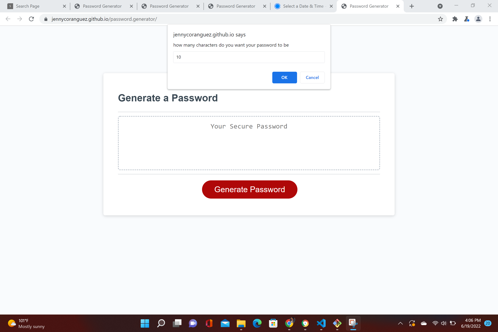
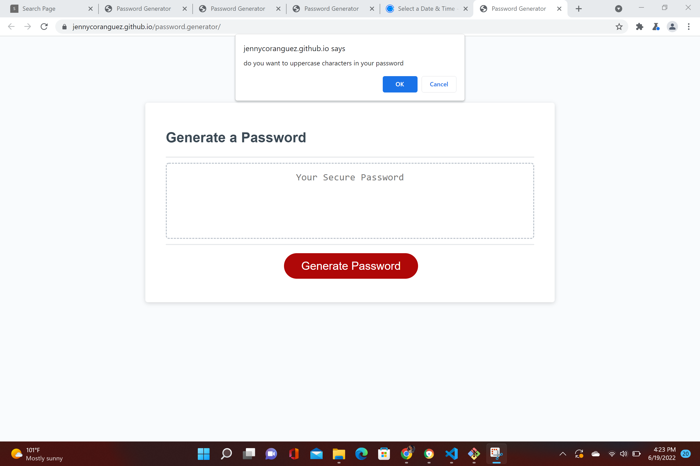
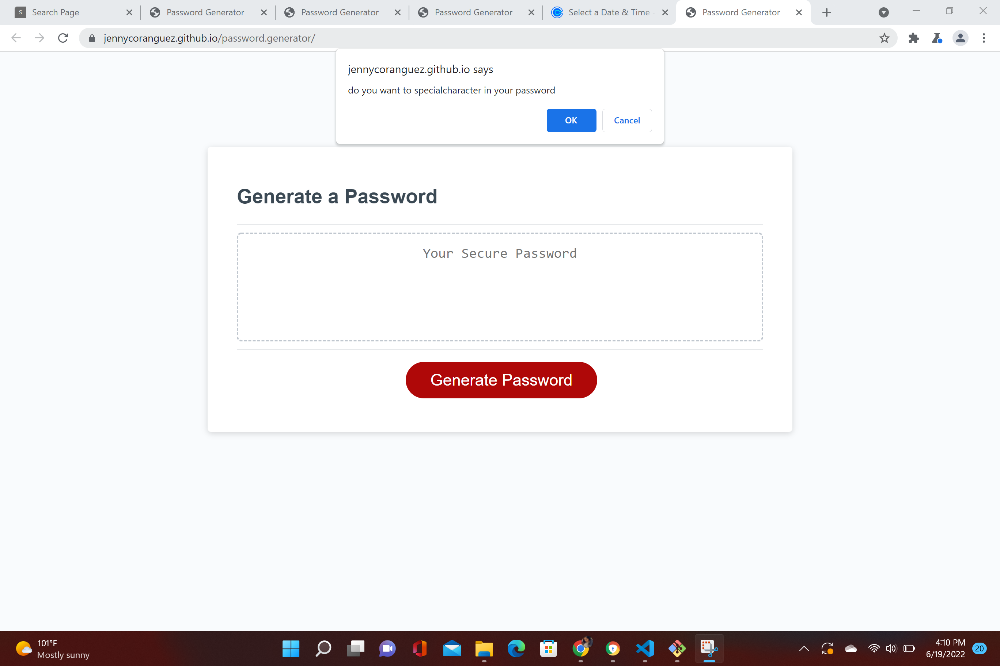
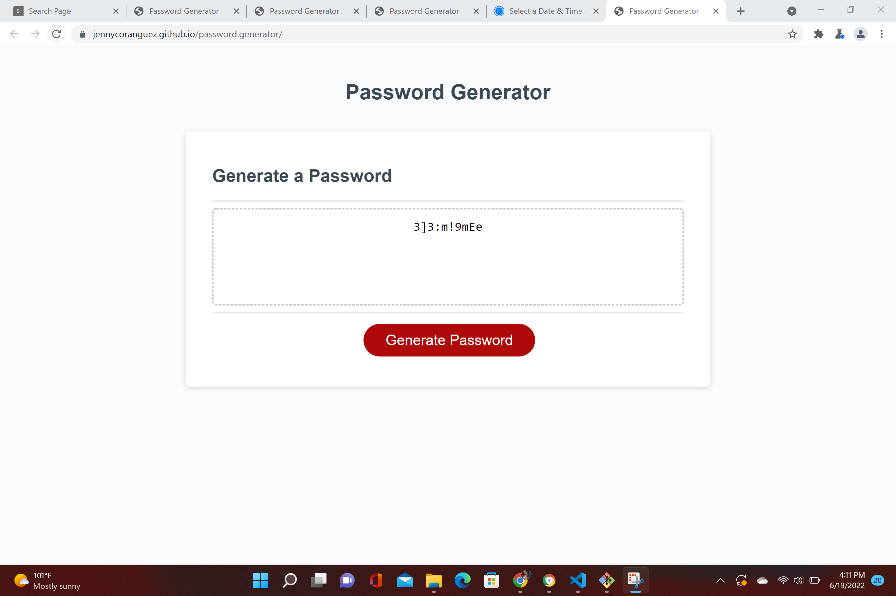

# password.generator

What I did in this password generator I added the elements which are the upper,case,numeric,and special characters.
Then I added 4 if statement to show what I want the function to do. 
Then I did a loop to be able to do a random password.

lIVE URL (https://github.com/Jennycoranguez/password.generator)
GIT HUB URL (https://jennycoranguez.github.io/password.generator/)

1. First Question:

    

2. Second Question

    

3. Third Question

    

4. Fourth Question

    

5. Fifth Question

    

